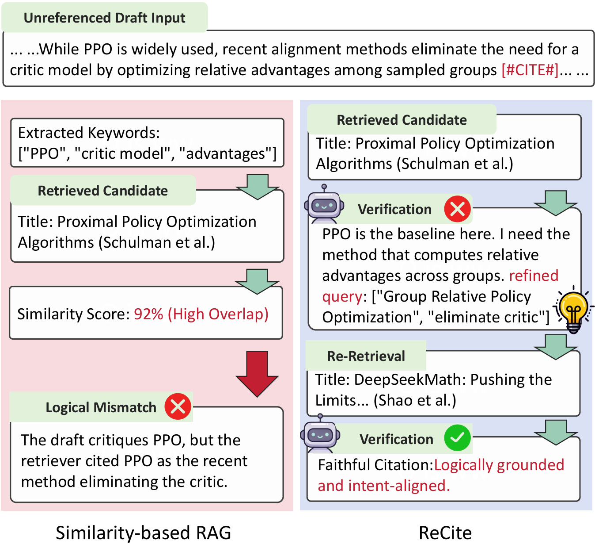
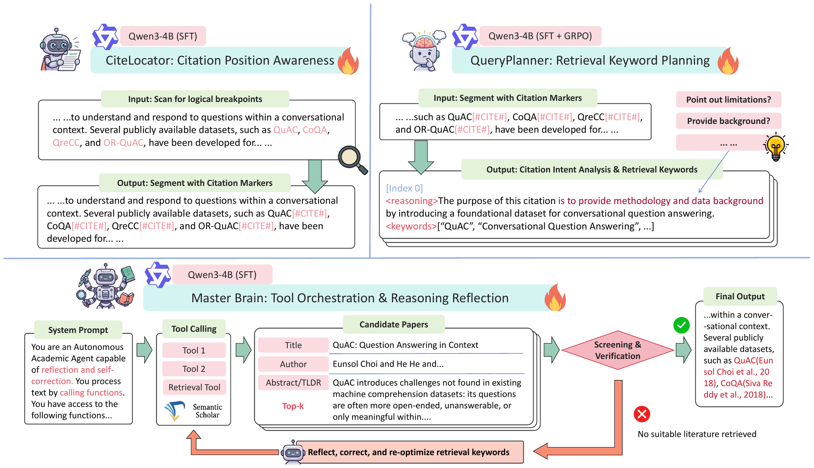
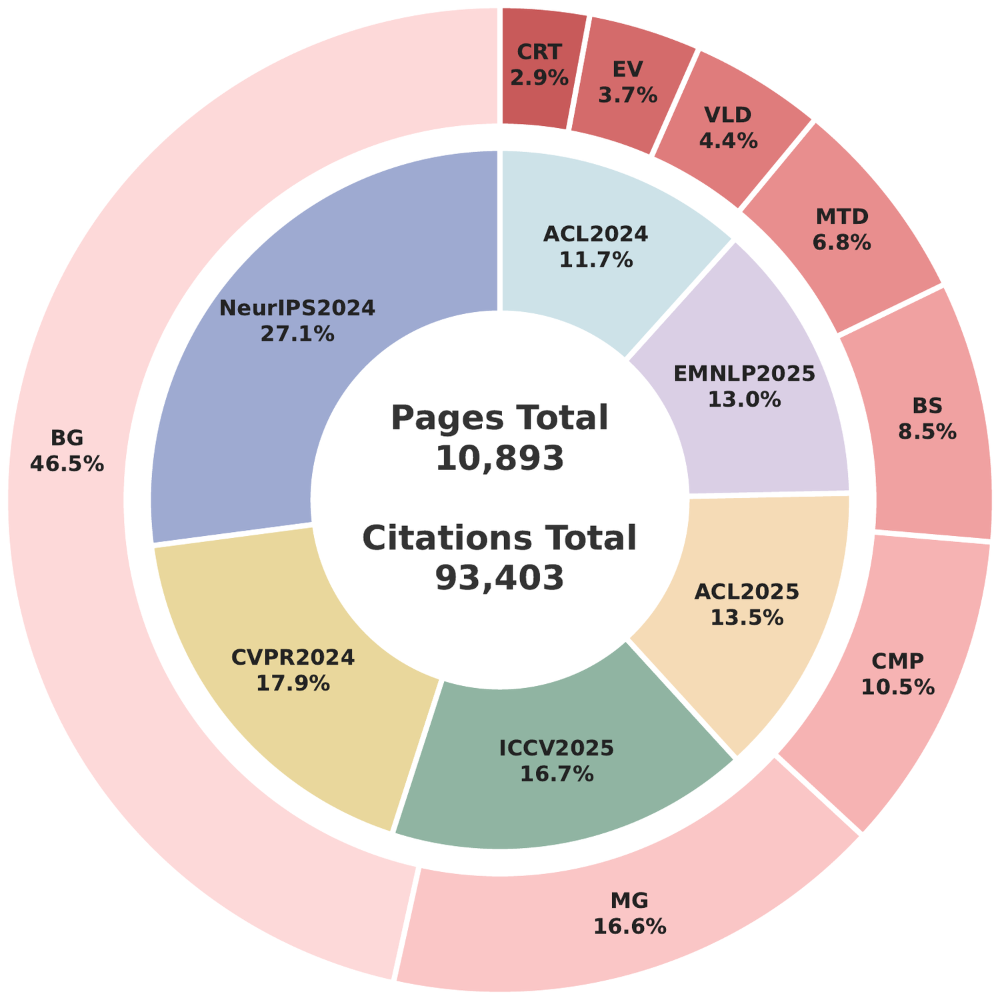
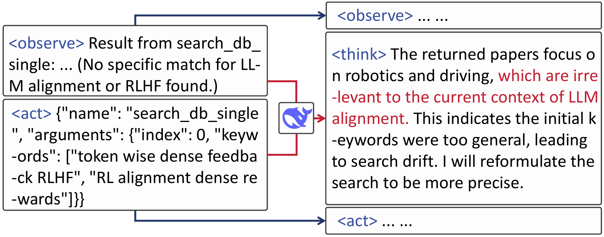
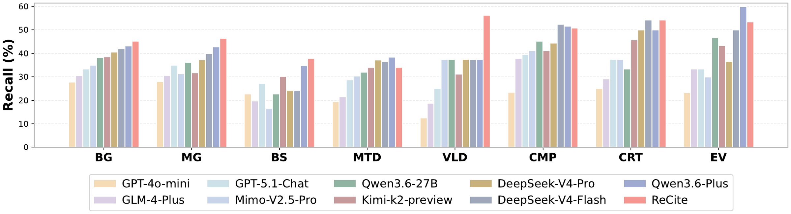
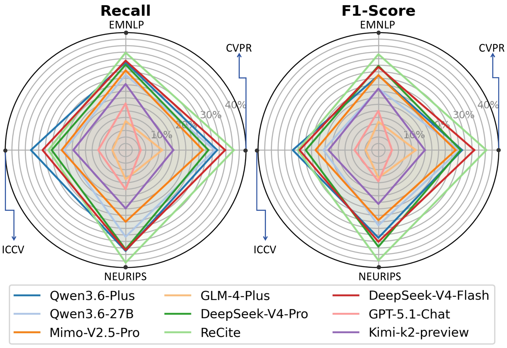
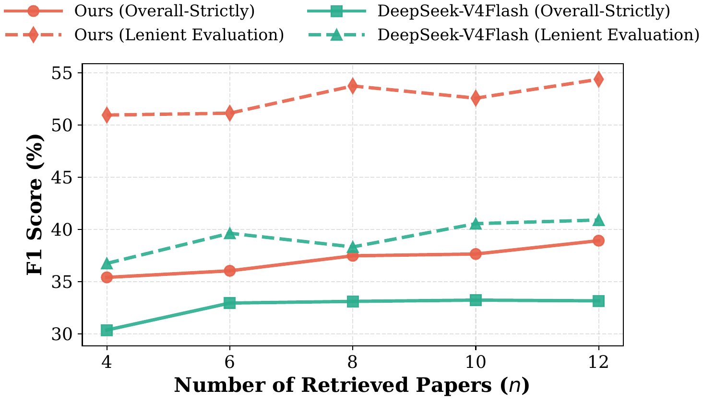

<div align="center">

<h1>ReCite</h1>
<p><em>Agentic Reasoning for Faithful Citation</em></p>

<a href="https://hyy279.github.io/ReCite/"></a>
<a href="ReCite.pdf"></a>
<a href="https://github.com/Hyy279/ReCite"></a>
<a href="LICENSE"></a>

Yuyang Huang<sup>1</sup> &middot; <a href="https://www.libobo.site/" target="_blank" rel="noopener">Bobo Li</a><sup>2&ast;</sup> &middot; Jiajia Song<sup>2</sup> &middot; Yuzhe Ding<sup>1</sup> &middot; Chong Teng<sup>1</sup> &middot; Fei Li<sup>1</sup> &middot; Donghong Ji<sup>1&ast;</sup>

<sup>1</sup>Wuhan University &nbsp;&middot;&nbsp; <sup>2</sup>National University of Singapore

</div>

<p align="center">

</p>

## Overview

Citation requires **logical support, not merely textual similarity**. ReCite turns citation into a closed-loop agentic
reasoning task: locate where citations are needed, infer why a paper is cited, retrieve from authentic academic
databases, and verify whether the evidence truly supports the claim.

ReCite is accepted at **Findings of EMNLP 2026**.

<div align="center">

</div>

## Highlights

- **3 specialized Qwen3-4B modules**: CiteLocator, QueryPlanner, and Master Brain.
- **Strict F1 of 39.15%** &mdash; best among all tested methods, including 1.6T-scale generative baselines.
- **CiteLocator reaches Overall F1 of 66.37%**, outperforming all LLM baselines on citation location prediction.
- **Reflective re-retrieval** lets the agent recover from retrieval drift instead of propagating errors.
- Only **4B parameters** in total.

## Modules

- **CiteLocator** &mdash; citation location perception; predicts where citations belong and whether they are Mandatory or Optional.
- **QueryPlanner** &mdash; intent-aware query planning (SFT + GRPO); infers citation intent and generates retrieval keywords.
- **Agent (Master Brain)** &mdash; tool orchestration and reflective verification; queries Semantic Scholar and re-retrieves when evidence is inconsistent.

## Data

The corpus is built from **10,893 LaTeX papers** at top CS venues (2024&ndash;2025) with supervision for:

- citation **location**
- CAP-8 citation **intent**
- reflective **trajectories**

Training and evaluation data are provided under `Data/`.

<div align="center">


</div>

## Results

<div align="center">

</div>

<div align="center">

&nbsp;

</div>

## Setup

```bash
pip install -r requirements.txt
```

Start the three OpenAI-compatible vLLM endpoints with your trained models, then run:

```bash
python "Agent（Master Brain）/agent.py"
```

Or import it after renaming the folder to a valid package name:

```python
from Agent.agent import CiteAgent

agent = CiteAgent(s2_api_keys=["key1", "key2"], device="cuda")
```

## Citation

```bibtex
@inproceedings{huang2026recite,
  title     = {ReCite: Agentic Reasoning for Faithful Citation},
  author    = {Huang, Yuyang and Li, Bobo and Song, Jiajia and Ding, Yuzhe
               and Teng, Chong and Li, Fei and Ji, Donghong},
  booktitle = {Findings of the Association for Computational Linguistics:
               EMNLP 2026},
  year      = {2026}
}
```

Project page: [https://hyy279.github.io/ReCite/](https://hyy279.github.io/ReCite/)

## License

This project is released under the [MIT License](LICENSE).
